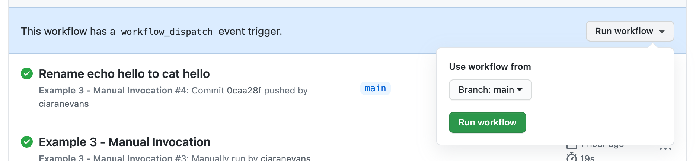

# Example 4 - Manual Invocation With Parameters

## TL;DR:

Example 4 is a simple workflow which says hello to the value of `name` in the `workflow_dispatch` inputs.

## Code

The example contains one file: [`hello.sh`](./hello.sh) which says `Hello <name>`.

## Workflow

Within [`.github/workflows/example-4-manual-invocation-with-parameters.yaml`](../.github/workflows/example-4-manual-invocation-with-parameters.yaml), we're defining one job, which has the following steps:

* Checkout the code
* Run script

This workflow **only** runs when either a commit is pushed to the `main` branch, or when a pull request is raised against the `main` branch, **OR** when you manually invoke it via a button on the GitHub UI:

If the workflow is run via a push/pull request, then the default value of `name` will be `Workflow`. If the workflow is run via `workflow_dispatch` without a value for `name`, the default will be `Manual Workflow`.
