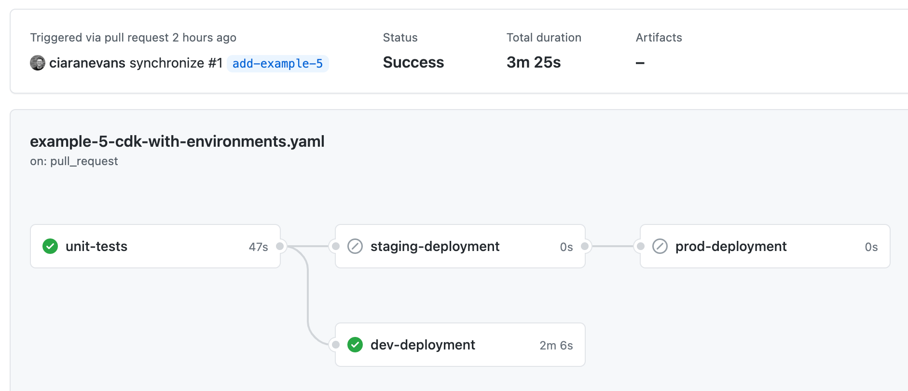
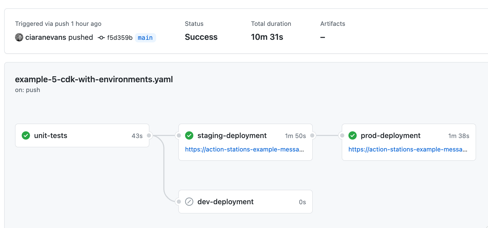

# Example 5 - CDK With Environments

## TL;DR:

Example 5 is quite a noisy example. At the highest level, it's trying to display how to use GitHub Actions Environments to do both PR builds/deploys and then blue/green deployments.

## Code

Within `src/` there is a file [`put_message.py`](./src/put_message.py) which contains the function `put_message` - this takes an `env` which is the environment to deploy to, `stack_output_path` which is the path to the CDK output.json made after deploying, and `secret` - which is a value to display in the message. This message is uploaded to the deployed stacks bucket as an HTML file to view. The function prints the full URL of the HTML file so that downstream processes can use it.

Within `cdk/` there is a very simple AWS CDK app which deploys a public Bucket. This stack has two outputs: `message-bucket-name-{identifier}` and `message-bucket-url-{identifier}`.

Within `tests/` there is a file [`unit/test_put_message.py`](./tests/unit/test_put_message.py) which tests that:

* The message is added to the bucket
* The message contains the correct secret
* The message is public to anyone
* The full URL is printed by the function

Within `tests/` there is a file [`integration/test_put_message.py`](./tests/integration/test_put_message.py) which tests that:

* The file is available via a public URL as defined by `DEPLOYED_MESSAGE_URL` in `.env`
* The contents of the file match what is expected with the values of `IDENTIFIER` and `SECRET` in `.env`

## Workflow

Within [`.github/workflows/example-5-cdk-with-environments.yaml](../.github/workflows/example-5-cdk-with-environments.yaml), we're defining 4 jobs:

### unit-tests

This job is used in all scenarios: pull requests and main builds, it does the following:

* Checks out the code
* Installs Python
* Installs Poetry
* Installs dependencies (`make example-5-install`)
* Runs unit tests (`make example-5-unit-tests`)

### dev-deployment

This job is only used on pull request events, it first needs `unit-tests` to have succeeded. This job is set to the **environment** `dev` which we set up in the GitHub UI, the job does the following:

* Checks out the code
* Installs Python
* Installs Poetry
* Sets up Node
* Installs dependencies (`make example-5-install`)
* Configures AWS CLI (**This uses secrets named `AWS_ACCESS_KEY_ID` and `AWS_SECRET_ACCESS_KEY` in the `dev` environment on GitHub - These are the same secret names in all environments, but the values are different**)
* Makes the `.env` file (Populated with `IDENTIFIER`, `OWNER`, `AWS_DEFAULT_REGION`, and `SECRET` which is the GitHub Secret `HTML_SECRET` defined in the `dev` environment)
* Deploys the stack (`make example-5-deploy`)
* Puts `message.html` in the bucket (`make example-5-put-message`) - It also sets the step output to the URL of the file
* Puts the URL of the file into `.env` as `DEPLOYED_MESSAGE_URL`
* Runs integration tests (`make example-5-integration-tests`)
* Destroys the stack (`make example-5-destroy`)

### staging-deployment

This job is only used on `main` branch builds, it first needs `unit-tests` to have succeeded. This job is set to the **environment** `staging`. The **environment** URL is set to be the value of `steps.put-message`. This will be available when the job succeeds. The job does the following:

* Checks out the code
* Installs Python
* Installs Poetry
* Sets up Node
* Installs dependencies (`make example-5-install`)
* Configures AWS CLI (**This uses secrets named `AWS_ACCESS_KEY_ID` and `AWS_SECRET_ACCESS_KEY` in the `staging` environment on GitHub - These are the same secret names in all environments, but the values are different**)
* Makes the `.env` file (Populated with `IDENTIFIER`, `OWNER`, `AWS_DEFAULT_REGION`, and `SECRET` which is the GitHub Secret `HTML_SECRET` defined in the `staging` environment)
* Deploys the stack (`make example-5-deploy`)
* Puts `message.html` in the bucket (`make example-5-put-message`) - It also sets the step output to the URL of the file
* Puts the URL of the file into `.env` as `DEPLOYED_MESSAGE_URL`
* Runs integration tests (`make example-5-integration-tests`)

### prod-deployment

This job is only used on `main` branch builds, it first needs `staging-deployment` to have succeeded. This job is set to the **environment** `prod`. The **environment** URL is set to be the value of `steps.put-message`. This will be available when the job succeeds. The job does the following:

* Checks out the code
* Installs Python
* Installs Poetry
* Sets up Node
* Installs dependencies (`make example-5-install`)
* Configures AWS CLI (**This uses secrets named `AWS_ACCESS_KEY_ID` and `AWS_SECRET_ACCESS_KEY` in the `prod` environment on GitHub - These are the same secret names in all environments, but the values are different**)
* Makes the `.env` file (Populated with `IDENTIFIER`, `OWNER`, `AWS_DEFAULT_REGION`, and `SECRET` which is the GitHub Secret `HTML_SECRET` defined in the `prod` environment)
* Deploys the stack (`make example-5-deploy`)
* Puts `message.html` in the bucket (`make example-5-put-message`) - It also sets the step output to the URL of the file

## Workflow success - PR

When the workflow succeeds for a PR, you'll see a summary like:



You'll notice that the `unit-tests` ran and `dev-deployment` did, no deployment remains up and you cannot click on a URL to the deployment.

## Workflow success - Main

When the workflow succeeds for a `main` build, you'll see a summary like:



You'll notice that the `unit-tests` ran, `staging-deployment` ran, `prod-deployment` ran, and `dev-deployment` did not. You can see clickable URLs on `staging` and `prod` which will take you to HTML files in the separate environments.

## Workflows and Environments

GitHub Action Environments allow you to:

* Separate your GitHub Secrets into environments
* Maintain the same names for Secrets so that your code only needs to refer to one set of names
* Dynamically assign a Actions Job to an environment
* Attach a URL to a Actions Job environment (To whatever you deployed)
* Add environment protection - This allows you to require a reviewer to approve a deployment to your environment

You can read more about GitHub Action Environments [here](https://docs.github.com/en/actions/reference/environments), I found [this](https://dev.to/n3wt0n/everything-you-need-to-know-about-github-actions-environments-9p7) post and accompanying video **really** useful.

# Development

To get setup, run:

```bash
$ make install # Installs the dependencies in `pyproject.toml`, sets up a Poetry Virtual Environment, and echoes its location for use in IDEs, it also installs the dependencies in `package-lock.json`
```

To lint the code in `cdk`, `src/`, and `tests/`, run:

```bash
$ make lint # Runs flake8, isort, and black in check only mode and outputs any linting issues
```

To format the code in `cdk`, `src/`, and `tests/`, run:

```bash
$ make format # Runs isort and black, formatting your code
```

To run the unit tests, run:

```bash
$ make unit-tests # Runs the unit test suite in `tests/unit`
```

To see what you'll deploy, run:

```bash
$ make diff # Runs a CDK diff of your stack using your `.env` file
```

To deploy your stack, run:

```bash
$ make deploy # Runs a CDK deploy of your stack using your `.env` file, it creates a file called `example-5-outputs.json` which are the CDK outputs
```

To put the message in your deployed bucket, run:

```bash
$ make put-message # Uploads the message to S3 with the values of `SECRET` and `IDENTIFIER` in `.env` and the outputs in `example-5-outputs.json`. This also outputs the full URL of the message - **you should put this in your `.env` file as `DEPLOYED_MESSAGE_URL`**
```

To run the integration tests against your deployed and now populated stack, run:

```bash
$ make integration-tests # Runs the integration test suite in `tests/integration`
```

To destroy your stack, run:

```bash
$ make destroy # Runs a CDK destroy of your stack using your `.env` file
```

## .env file

A `.env` file is expected within `example-5-cdk-with-environments/`. This file should contain the following before you do any deployments:

```bash
IDENTIFIER="<a-unique-value-to-tie-to-the-deployment>" # This is the environment in GitHub Actions
OWNER="<your-name>"
AWS_DEFAULT_PROFILE="<your-preferred-named-aws-cli-profile>"
AWS_DEFAULT_REGION="<your-preferred-aws-region>"
SECRET="<a-secret-value-to-display-in-the-message>" # This is only needed on local deploys, this value is retrieved from `${{ secrets.HTML_SECRET }} in GitHub Actions
```

You will need to add the variable `DEPLOYED_MESSAGE_URL` once you have run `make put-message`.
